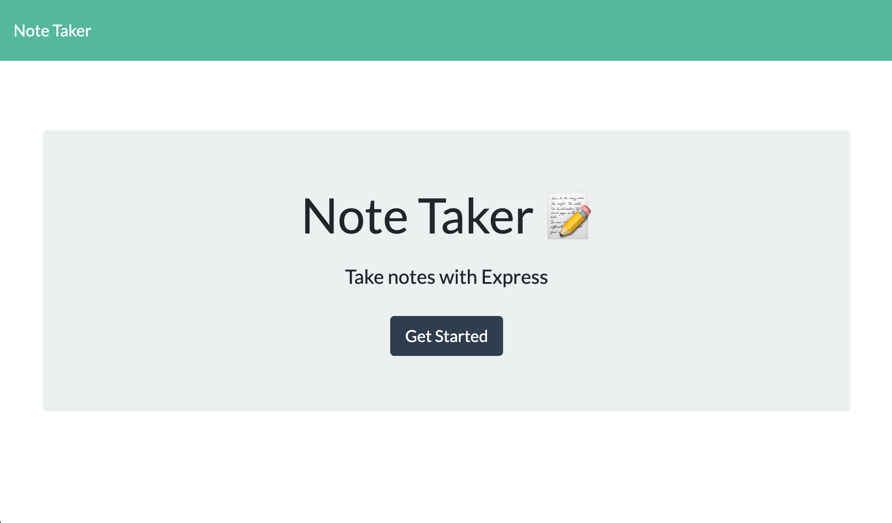
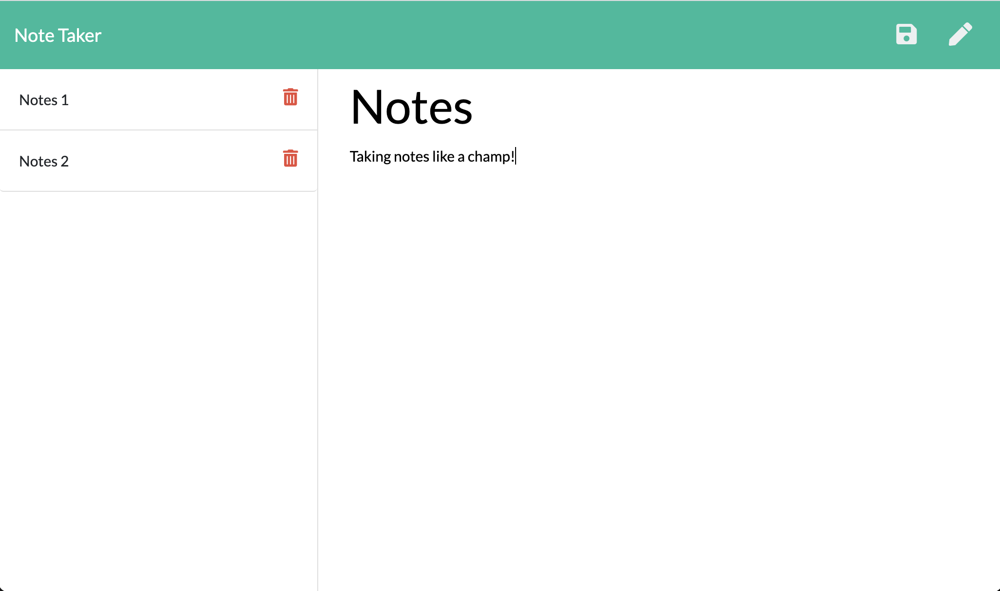

# Note Taker
## 

## Table of Contents:
<ol>
<li><a href="#description">Description</a></li>
<li><a href="#installation">Installation</a></li>
<li><a href="#usage">Usage</a></li>
<li><a href="#testing">Testing</a></li>
<li><a href="#contributing">Contributing</a></li>
<li><a href="#questions">Questions</a></li>
<li><a href="#license">License</a></li>
</ol>

## Description:
For users that need to keep track of a lot of information, it's easy to forget or be unable to recall something important. Being able to take persistent notes allows users to have written information available when needed.  This application can be used to write, save, and delete notes. This application will use an express backend and save and retrieve note data from a JSON file.  The user can delete or retrieve notes at their convenience based upon a unique notes title they have entered.

## Installation :
The application can be run in the Heroku app.

### Here is that website:

https://note-taker-express-ckhilpisch.herokuapp.com/

## Usage: 
The user will open the Heroku app and find the note taker page.   Then the user can add notes by creating a title and filling in the text area.   When the user hits save the information is saved to the database.   Then the user can create a new note.   The user also has the capabilities to delete old notes or read saved notes by clicking on the saved notes.
This is the completed site:

### Here is the site in action:

## Testing:

No tests were run on this application

## Contributing

Pull requests are always welcome.  When contributing to this repository, please first discuss the change you wish to make via email or issue.  
After approval, please follow the "fork-and-pull" Git workflow.
<ol>
<li>Fork the repo on GitHub</li>
<li>Clone the project to your own machine</li>
<li>Commit changes to your own branch</li>
<li>Push your work back up to your fork</li>
<li>Submit a Pull request so that we can review your changes</li>
</ol>

## Questions :

If you have any questions, feel free to reach out to me.   My email is ckhilpisch@gmail.com.

## License :

MIT License
Informataion avaiable here: 
https://opensource.org/licenses/MIT
